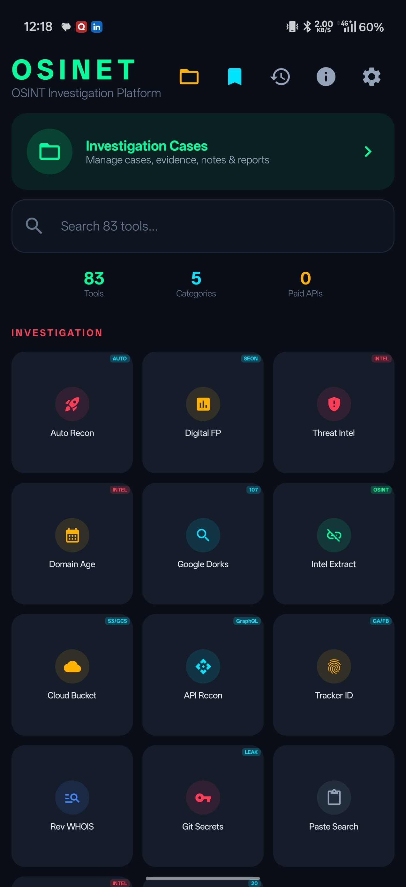
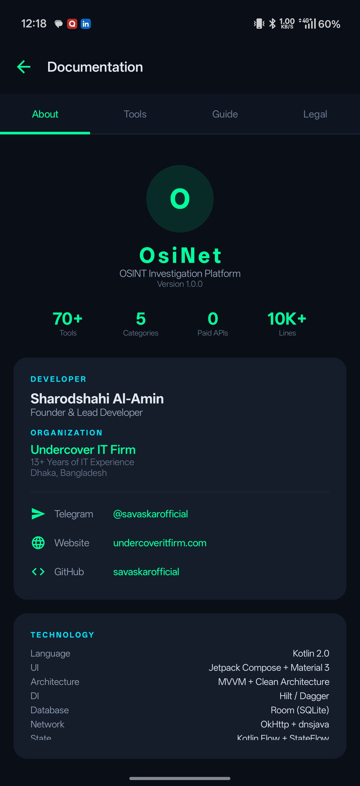
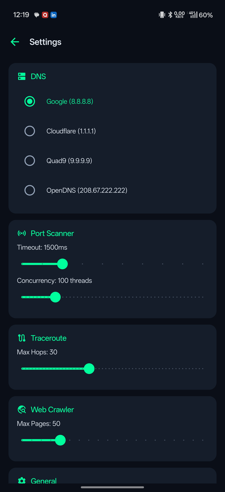

  

<h1 align="center">OsiNet</h1>

  <strong>OSINT Investigation Platform for Android</strong>

  
  
  
  
  
  

  <a href="#download">Download</a> •
  <a href="#features">Features</a> •
  <a href="#screenshots">Screenshots</a> •
  <a href="#architecture">Architecture</a> •
  <a href="#privacy">Privacy</a> •
  <a href="#contact">Contact</a>

---

**OsiNet** is a self-contained, native Android OSINT (Open Source Intelligence) investigation toolkit with **85+ tools** across 5 categories — all operating on **zero paid APIs**. Built for investigators, penetration testers, security researchers, and OSINT professionals who need a comprehensive mobile toolkit that respects operational security.

Every network request goes directly from your device to the target — no intermediary servers, no telemetry, no cloud dependencies.

---

## Download

| Version | Min Android | Size | Link |
|---------|-------------|------|------|
| **v1.0.0** | Android 8.0 (API 26) | ~32 MB | [`app-debug.apk`](app-debug.apk) |

> **Install:** Enable "Install from unknown sources" in your device settings, then open the APK.

---

## Screenshots

  
  &nbsp;&nbsp;
  
  &nbsp;&nbsp;
  

---

## Features

### 🔴 Investigation (14 tools)
| Tool | Description |
|------|-------------|
| **Auto Recon** | Automated multi-module reconnaissance — DNS, WHOIS, headers, tech fingerprint, Shodan, subdomains, Wayback, threat intel, port scan in one scan |
| **Digital Footprint** | Risk-scored digital presence analysis across verified API-backed platforms |
| **Threat Intel** | AlienVault OTX + URLhaus correlation for IPs and domains |
| **Domain Age** | WHOIS-based registration age + expiry analysis |
| **Google Dorks** | 107 pre-built dork templates across 12 categories |
| **Intel Extractor** | Deep link, email, phone, IP extraction from any URL |
| **Cloud Bucket Hunter** | AWS S3, Azure Blob, GCS bucket enumeration and permission testing |
| **API Recon** | 50+ endpoint probes (Swagger, OpenAPI, GraphQL introspection, Actuator, .env) |
| **Tracker ID OSINT** | Google Analytics, Facebook Pixel, and ad network tracker extraction |
| **Reverse WHOIS** | RDAP (RFC 9082) registrant lookup with ViewDNS + HackerTarget fallback |
| **Git Secrets** | 40+ secret patterns × 3 search backends (GitHub, Sourcegraph, Google dorks) |
| **Paste Search** | Pastebin/Ghostbin/Rentry OSINT search links |
| **Shodan Lookup** | Free InternetDB API — ports, CVEs, hostnames, tags |
| **IP Blacklist** | 20 DNSBL check against Spamhaus, Barracuda, SORBS, etc. |

### 🟢 Network Recon (21 tools)
Ping, Port Scanner (with banner-based service version detection), DNS Lookup, WHOIS, Traceroute (with GeoIP), Subnet Calculator, SSL Certificate Inspector, GeoIP (map), Reverse DNS, Redirect Tracer, Speed Test, Ping Sweep, Latency Monitor, ASN Lookup, Wake-on-LAN, DNS Propagation, Reverse IP, TLS Cipher Analyzer, ARP Table, Tor/Proxy Checker (Orbot integration), Dark Web Search (Ahmia), MQTT IoT Recon

### 🔵 Web Recon (16 tools)
HTTP Headers, Technology Fingerprint, Subdomain Brute-force, CMS Detection, WAF Detection, Robots.txt Parser, Web Crawler, Certificate Transparency (crt.sh), HTTP Methods Tester, CORS Misconfiguration Scanner, Favicon Hash (Shodan query generator), Site Status Checker, Wayback Machine (with year/month filter), Security.txt Parser, Cookie Analyzer, HTTP Diff

### 🟡 Social / People OSINT (11 tools)
| Tool | Description |
|------|-------------|
| **Person Recon** | Name → username variants → verified platform checks → people search engines → Google dorks → Gravatar email discovery |
| **Social Profiler** | 22 API-verified platforms + 14 manual-check SPA platforms |
| **Username Search** | Same 22 verified platforms — API-first, zero false positives |
| **Breach Check** | XposedOrNot API + Proton Sentinel + Gravatar + deep-search links (HIBP, DeHashed, IntelX, LeakCheck) |
| **Email OSINT** | MX/SPF/DMARC/DKIM + Gravatar + breach correlation |
| **Email Dorks** | 70+ dorks across 10 categories (breach sites, code repos, dark web mirrors) |
| **Phone Lookup** | Carrier prefix DB (BD/PK/IN/US/UK) + OSINT deep-links (WhatsApp, Truecaller, Sync.me, Eyecon) + 8 Google dorks |
| **Email Header Analyzer** | Hop-by-hop routing, SPF/DKIM/DMARC validation, originating IP extraction |
| **Name → Username** | Pattern-based username generator from real name |
| **Reverse Image** | Multi-engine reverse image search (Google, Yandex, TinEye, Bing) |
| **People Dorks** | 80+ people-finding Google dork templates |

### 🛠️ Utilities (20 tools)
Hash Generator, Encoder/Decoder (Base64/URL/HTML/Hex), EXIF Data Extractor, MAC Vendor Lookup, Password Generator, WiFi Info, Device Info, User Agent Parser, Text Analyzer, Meta Strip (with anti-reverse-image pixel noise), JSON Formatter, IP Format Converter, Unix Timestamp Converter, cURL Generator, Regex Tester, UUID Generator, Port Lookup Database, Crypto Recon (BTC/ETH/LTC/TRX), Shadow Calculator (chronolocation IMINT), Infrastructure Map (Overpass API)

### 📁 Investigation Management
- **Case Manager** — Create investigation cases, auto-link scan results, attach evidence and notes, STIX 2.1 / JSON / CSV export
- **Bookmarks** — Save any tool result for later
- **History** — Full scan history with search
- **Settings** — DNS server selection, port scan timeout/concurrency, traceroute max hops, crawler depth

---

## Architecture

| Layer | Technology |
|-------|-----------|
| **Language** | Kotlin 2.0 |
| **UI** | Jetpack Compose + Material 3 |
| **Architecture** | MVVM + Clean Architecture |
| **DI** | Hilt / Dagger |
| **Database** | Room + SQLCipher (AES-256 encryption) |
| **Network** | OkHttp (custom client with SOCKS5/Tor proxy support) |
| **DNS** | dnsjava (programmatic DNS resolution) |
| **State** | Kotlin Flow + StateFlow |
| **Target** | Android API 26–35 |

### Security Architecture
- **SQLCipher 256-bit AES** — All investigation data encrypted at rest
- **SOCKS5 / HTTP proxy support** — Route traffic through Orbot/Tor
- **Rate limiting** — Exponential backoff on all external API calls
- **No telemetry** — Zero analytics, zero crash reporting, zero phone-home
- **Anti-reverse-image** — MetaStrip adds pixel noise to prevent reverse image tracing of exported screenshots

---

## Privacy

OsiNet does **not** collect, store, or transmit any personal data to external servers.

- All investigation data is stored **locally** on your device in an encrypted SQLite database
- Network requests go **directly** from your device to the targets you investigate and to free public OSINT APIs
- **No analytics SDK**, no Firebase, no Crashlytics, no third-party tracking
- The app has **no server-side component** — it is entirely self-contained

Free APIs used may have their own privacy policies. We recommend reviewing the terms of service for: ip-api.com, shodan.io (InternetDB), abuse.ch, alienvault.com, archive.org, xposedornot.com.

---

## Permissions

| Permission | Why |
|-----------|-----|
| `INTERNET` | All OSINT tools require network access |
| `ACCESS_NETWORK_STATE` | Check connectivity before scans |
| `ACCESS_WIFI_STATE` / `CHANGE_WIFI_STATE` | WiFi Info tool |
| `ACCESS_FINE_LOCATION` | GeoIP accuracy + Infrastructure Map |
| `READ_MEDIA_IMAGES` | EXIF extraction from gallery |
| `FOREGROUND_SERVICE` | Long-running scans (Auto Recon, Port Scan) |
| `POST_NOTIFICATIONS` | Scan completion notifications (Android 13+) |

---

## Legal Disclaimer

OsiNet is designed for **authorized security research, ethical hacking, and legitimate OSINT investigations only**. Users are solely responsible for ensuring their use of this tool complies with applicable laws and regulations in their jurisdiction.

**Do not** use OsiNet to:
- Access systems or data without authorization
- Conduct surveillance on individuals without legal basis
- Violate any applicable computer fraud, privacy, or wiretapping laws

The developer assumes no liability for misuse of this software.

---

## Contact

| | |
|---|---|
| **Developer** | Sharodshahi Al-Amin |
| **Organization** | [Undercover IT Firm](https://undercoveritfirm.com) |
| **Location** | Dhaka, Bangladesh |
| **Telegram** | [@savaskarofficial](https://t.me/savaskarofficial) |
| **GitHub** | [savaskarofficial](https://github.com/savaskarofficial) |
| **Experience** | 13+ Years in IT & Cybersecurity |

---

  <strong>Built with 🇧🇩 in Dhaka</strong> 
  © 2024-2026 Undercover IT Firm. All rights reserved.

